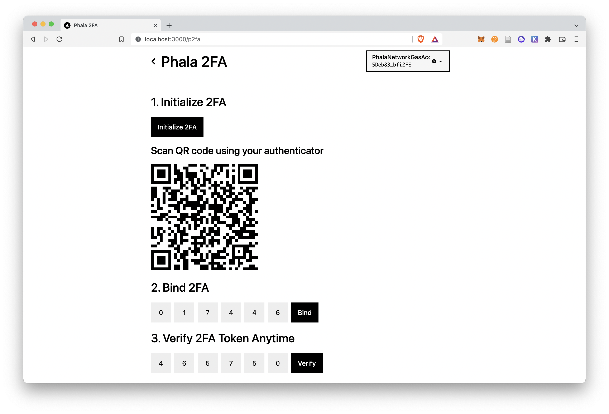

# Phala 2FA



This application achieves two-factor authentication on chain, without leaking any sensitive data. Specifically, secrets for 2FA are all generated on-chain with Phala Fat Contract, which ensures confidentiality and integrity.

This application is possible to serve as **a second layer for wallet protections**. Nowadays, the loss of private keys or mnemonic phrases generally predicts the loss of wallets. However, if one enables 2FA on chain, even the private keys are lost, funds can be still safe.

## Installation

### Contract

This application is deployed using Parity ink!, so in order to compile the contract you need to properly install `cargo-contract`. You can follow the guides [here](https://github.com/paritytech/cargo-contract#installation).

After that, you can compile the contract using the following command:

```shell
git clone https://github.com/Soptq/fat-p2fa
cd fat-p2fa
cargo +nightly contract build
```

After building, you should notice that there are some files generated in the `target/ink` folder.

### Deploy

This contract should be deployed to Phala Network as they provide confidential computing which is crucial for this application. You can deploy the contract following the guides [here](https://wiki.phala.network/en-us/build/developer/fat-contract-tutorial/#deploy).

### Frontend

You firstly need to install dependencies for the frontend.

```shell
cd frontend
yarn
```

Then you need to build the `@phala/sdk` for interacting with Phala Network.

```shell
yarn build
```

Finally, you can run the frontend.

```shell
yarn dev:example
```

### Pre-deployed contract on POC-5 Testnet

Contract ID: 0x690228d924cd0dbbd0368a420e30f6e305e1d1676361319b59f8b8aa676dd7cb

ABI:

```json
{
  "source": {
    "hash": "0x8f55617cd940bbec1fe59dfe368e419067cef3197cdf812433b27f5b060c4893",
    "language": "ink! 3.0.1",
    "compiler": "rustc 1.62.0-nightly"
  },
  "contract": {
    "name": "fat-p2fa",
    "version": "0.1.0",
    "authors": [
      "[your_name] <[your_email]>"
    ]
  },
  "V3": {
    "spec": {
      "constructors": [
        {
          "args": [
            {
              "label": "salt",
              "type": {
                "displayName": [
                  "Vec"
                ],
                "type": 2
              }
            },
            {
              "label": "digits",
              "type": {
                "displayName": [
                  "u8"
                ],
                "type": 0
              }
            },
            {
              "label": "skew",
              "type": {
                "displayName": [
                  "u8"
                ],
                "type": 0
              }
            },
            {
              "label": "duration",
              "type": {
                "displayName": [
                  "u64"
                ],
                "type": 1
              }
            }
          ],
          "docs": [],
          "label": "new",
          "payable": false,
          "selector": "0x9bae9d5e"
        },
        {
          "args": [],
          "docs": [],
          "label": "default",
          "payable": false,
          "selector": "0xed4b9d1b"
        }
      ],
      "docs": [],
      "events": [],
      "messages": [
        {
          "args": [],
          "docs": [],
          "label": "init_2fa",
          "mutates": true,
          "payable": false,
          "returnType": {
            "displayName": [
              "Result"
            ],
            "type": 9
          },
          "selector": "0xb5394179"
        },
        {
          "args": [],
          "docs": [],
          "label": "get_2fa_url",
          "mutates": false,
          "payable": false,
          "returnType": {
            "displayName": [
              "Option"
            ],
            "type": 12
          },
          "selector": "0x5449aa7d"
        },
        {
          "args": [
            {
              "label": "token",
              "type": {
                "displayName": [
                  "String"
                ],
                "type": 13
              }
            }
          ],
          "docs": [],
          "label": "verify_bind",
          "mutates": true,
          "payable": false,
          "returnType": {
            "displayName": [
              "Result"
            ],
            "type": 9
          },
          "selector": "0x09042a65"
        },
        {
          "args": [
            {
              "label": "token",
              "type": {
                "displayName": [
                  "String"
                ],
                "type": 13
              }
            }
          ],
          "docs": [],
          "label": "verify_token",
          "mutates": false,
          "payable": false,
          "returnType": {
            "displayName": [
              "Result"
            ],
            "type": 14
          },
          "selector": "0x00a45c08"
        },
        {
          "args": [],
          "docs": [],
          "label": "enabled_2fa",
          "mutates": false,
          "payable": false,
          "returnType": {
            "displayName": [
              "bool"
            ],
            "type": 8
          },
          "selector": "0x74d25563"
        },
        {
          "args": [
            {
              "label": "token",
              "type": {
                "displayName": [
                  "String"
                ],
                "type": 13
              }
            }
          ],
          "docs": [],
          "label": "unbind_2fa",
          "mutates": true,
          "payable": false,
          "returnType": {
            "displayName": [
              "Result"
            ],
            "type": 9
          },
          "selector": "0xd2b126de"
        }
      ]
    },
    "storage": {
      "struct": {
        "fields": [
          {
            "layout": {
              "cell": {
                "key": "0x0000000000000000000000000000000000000000000000000000000000000000",
                "ty": 0
              }
            },
            "name": "digits"
          },
          {
            "layout": {
              "cell": {
                "key": "0x0100000000000000000000000000000000000000000000000000000000000000",
                "ty": 0
              }
            },
            "name": "skew"
          },
          {
            "layout": {
              "cell": {
                "key": "0x0200000000000000000000000000000000000000000000000000000000000000",
                "ty": 1
              }
            },
            "name": "duration"
          },
          {
            "layout": {
              "cell": {
                "key": "0x0300000000000000000000000000000000000000000000000000000000000000",
                "ty": 2
              }
            },
            "name": "salt"
          },
          {
            "layout": {
              "cell": {
                "key": "0x0400000000000000000000000000000000000000000000000000000000000000",
                "ty": 3
              }
            },
            "name": "secret"
          },
          {
            "layout": {
              "cell": {
                "key": "0x0500000000000000000000000000000000000000000000000000000000000000",
                "ty": 7
              }
            },
            "name": "verified"
          }
        ]
      }
    },
    "types": [
      {
        "id": 0,
        "type": {
          "def": {
            "primitive": "u8"
          }
        }
      },
      {
        "id": 1,
        "type": {
          "def": {
            "primitive": "u64"
          }
        }
      },
      {
        "id": 2,
        "type": {
          "def": {
            "sequence": {
              "type": 0
            }
          }
        }
      },
      {
        "id": 3,
        "type": {
          "def": {
            "composite": {
              "fields": [
                {
                  "name": "offset_key",
                  "type": 6,
                  "typeName": "Key"
                }
              ]
            }
          },
          "params": [
            {
              "name": "K",
              "type": 4
            },
            {
              "name": "V",
              "type": 2
            }
          ],
          "path": [
            "ink_storage",
            "lazy",
            "mapping",
            "Mapping"
          ]
        }
      },
      {
        "id": 4,
        "type": {
          "def": {
            "composite": {
              "fields": [
                {
                  "type": 5,
                  "typeName": "[u8; 32]"
                }
              ]
            }
          },
          "path": [
            "ink_env",
            "types",
            "AccountId"
          ]
        }
      },
      {
        "id": 5,
        "type": {
          "def": {
            "array": {
              "len": 32,
              "type": 0
            }
          }
        }
      },
      {
        "id": 6,
        "type": {
          "def": {
            "composite": {
              "fields": [
                {
                  "type": 5,
                  "typeName": "[u8; 32]"
                }
              ]
            }
          },
          "path": [
            "ink_primitives",
            "Key"
          ]
        }
      },
      {
        "id": 7,
        "type": {
          "def": {
            "composite": {
              "fields": [
                {
                  "name": "offset_key",
                  "type": 6,
                  "typeName": "Key"
                }
              ]
            }
          },
          "params": [
            {
              "name": "K",
              "type": 4
            },
            {
              "name": "V",
              "type": 8
            }
          ],
          "path": [
            "ink_storage",
            "lazy",
            "mapping",
            "Mapping"
          ]
        }
      },
      {
        "id": 8,
        "type": {
          "def": {
            "primitive": "bool"
          }
        }
      },
      {
        "id": 9,
        "type": {
          "def": {
            "variant": {
              "variants": [
                {
                  "fields": [
                    {
                      "type": 10
                    }
                  ],
                  "index": 0,
                  "name": "Ok"
                },
                {
                  "fields": [
                    {
                      "type": 11
                    }
                  ],
                  "index": 1,
                  "name": "Err"
                }
              ]
            }
          },
          "params": [
            {
              "name": "T",
              "type": 10
            },
            {
              "name": "E",
              "type": 11
            }
          ],
          "path": [
            "Result"
          ]
        }
      },
      {
        "id": 10,
        "type": {
          "def": {
            "tuple": []
          }
        }
      },
      {
        "id": 11,
        "type": {
          "def": {
            "variant": {
              "variants": [
                {
                  "index": 0,
                  "name": "AccountNotInitialized"
                },
                {
                  "index": 1,
                  "name": "NotVerified"
                },
                {
                  "index": 2,
                  "name": "InvalidToken"
                }
              ]
            }
          },
          "path": [
            "fat_p2fa",
            "fat_p2fa",
            "Error"
          ]
        }
      },
      {
        "id": 12,
        "type": {
          "def": {
            "variant": {
              "variants": [
                {
                  "index": 0,
                  "name": "None"
                },
                {
                  "fields": [
                    {
                      "type": 13
                    }
                  ],
                  "index": 1,
                  "name": "Some"
                }
              ]
            }
          },
          "params": [
            {
              "name": "T",
              "type": 13
            }
          ],
          "path": [
            "Option"
          ]
        }
      },
      {
        "id": 13,
        "type": {
          "def": {
            "primitive": "str"
          }
        }
      },
      {
        "id": 14,
        "type": {
          "def": {
            "variant": {
              "variants": [
                {
                  "fields": [
                    {
                      "type": 8
                    }
                  ],
                  "index": 0,
                  "name": "Ok"
                },
                {
                  "fields": [
                    {
                      "type": 11
                    }
                  ],
                  "index": 1,
                  "name": "Err"
                }
              ]
            }
          },
          "params": [
            {
              "name": "T",
              "type": 8
            },
            {
              "name": "E",
              "type": 11
            }
          ],
          "path": [
            "Result"
          ]
        }
      }
    ]
  }
}
```