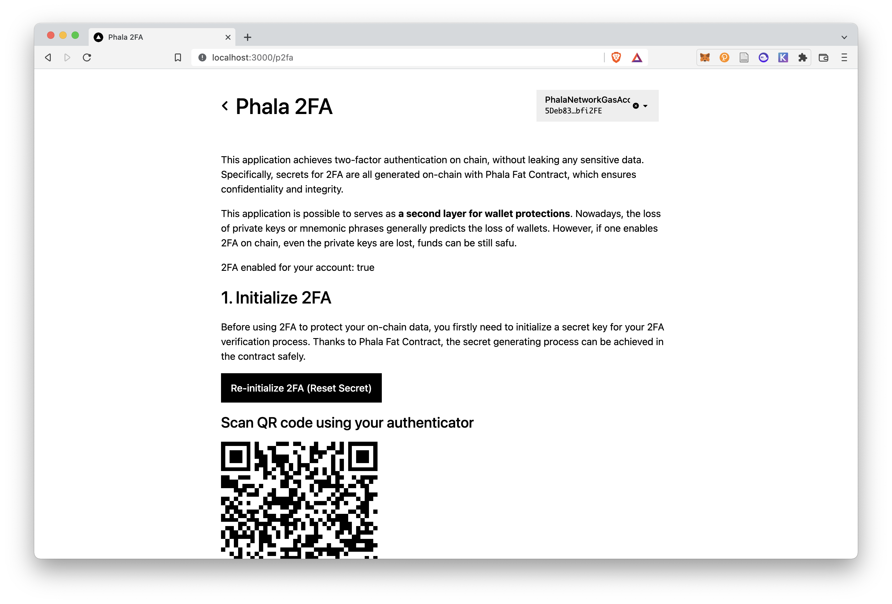

# Phala 2FA



This application achieves two-factor authentication on chain, without leaking any sensitive data. Specifically, secrets for 2FA are all generated on-chain with Phala Fat Contract, which ensures confidentiality and integrity.

This application is possible to serves as **a second layer for wallet protections**. Nowadays, the loss of private keys or mnemonic phrases generally predicts the loss of wallets. However, if one enables 2FA on chain, even the private keys are lost, funds can be still safu.

## Installation

### Contract

This application is deployed using Parity ink!, so in order to compile the contract you need to properly install `cargo-contract`. You can follow the guides [here](https://github.com/paritytech/cargo-contract#installation).

After that, you can compile the contract using the following command:

```shell
git clone https://github.com/Soptq/fat-p2fa
cd fat-p2fa
cargo +nightly contract build
```

After building, you should notice that there are some files generated in the `target/ink` folder.

### Deploy

This contract should be deployed to Phala Network as they provide confidential computing which is crucial for this application. You can deploy the contract following the guides [here](https://wiki.phala.network/en-us/build/developer/fat-contract-tutorial/#deploy).

### Frontend

You firstly need to install dependencies for the frontend.

```shell
cd frontend
yarn
```

Then you need to build the `@phala/sdk` for interacting with Phala Network.

```shell
yarn build
```

Finally, you can run the frontend.

```shell
yarn dev:example
```
